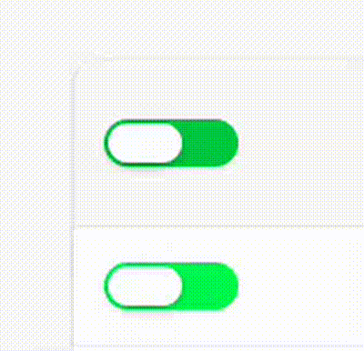

# Custom GTK Switch

A custom-designed GTK switch inspired by web switches, with smooth animations and a Mac-like press effect.

---

## Demo

See the switch in action:




---

## Features

- Smooth thumb animation
- Color changes when toggled
- Press effect (thumb grows slightly on click)
- Works with GTK3 and GTK4
- Fully CSS-based

---
## Installation
Download CSS file from [Releases](https://github.com/zeyad-pro/button-JTK-like-mac/releases)

**For GTK3:**

```bash
cp gtk.css ~/.config/gtk-3.0/
````

**For GTK4:**

```bash
cp gtk.css ~/.config/gtk-4.0/
```

Restart your GTK apps to see the effect.

---


## Notes

* The switch size and animation may vary depending on your GTK theme.
* True overshoot (like macOS) requires custom widgets, not just GTK Switch.
* Tested on Ubuntu GNOME with GTK3 and GTK4.

